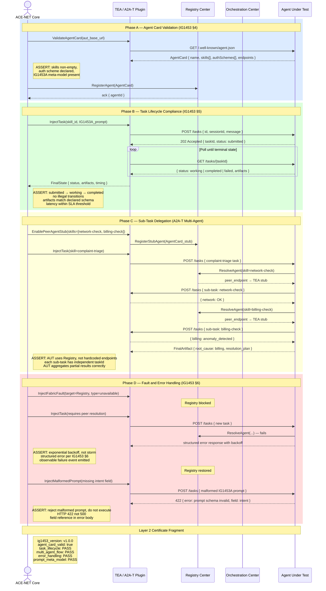

# A2A-T (IG1453) Protocol Compliance Test Flow — ACE-NET Layer 2 Certification

Sequence diagram for ACE-NET's Layer 2 certification: validating that an Agent Under Test (AUT) correctly implements the A2A-T protocol (IG1453) including Agent Card publication, task lifecycle state machine, multi-agent sub-task delegation, fault resilience, and IG1453A prompt meta-model compliance.

## Test Phase Summary

| Phase | What Is Tested | Key IG1453 Reference |
|-------|---------------|----------------------|
| A — Agent Card | Schema, skills taxonomy, auth scheme, IG1453A declaration | IG1453 §4.2 |
| B — Task Lifecycle | State machine correctness, artifact schema, SLA timing | IG1453 §5 |
| C — Sub-Task Delegation | Registry-based discovery, independent task IDs, result aggregation | A2A-T multi-agent flow |
| D — Fault Handling | Backoff on registry failure, graceful prompt rejection | IG1453 §6 / IG1453A §3 |
