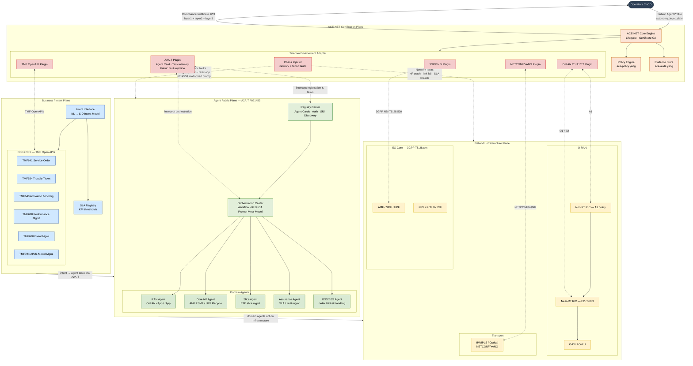

# ACE-NET Reference Architecture — A2A-T Aware

Four-plane reference architecture aligned to TMForum IG1401 Level 4 blueprint and IG1453 A2A-T Agent Fabric (Catalyst C26.0.910). The ACE-NET Certification Plane overlays all three operational planes via the Telecom Environment Adapter (TEA).

## Component Responsibilities

| Component | Responsibility |
|-----------|---------------|
| **A2A-T Plugin** | Validates Agent Cards, acts as peer agent stub, intercepts task lifecycle, injects fabric-level faults, validates IG1453A prompt meta-model |
| **Registry Center** | Agent discovery, authentication, skill management across the Agent Fabric |
| **Orchestration Center** | Multi-agent workflow coordination via IG1453A prompt meta-model |
| **Chaos Injector** | Injects both network-layer and Agent Fabric-layer faults per certification tier |
| **Policy Engine** | Evaluates observed behavior against `ace-policy.yang` rules and ECA definitions |
| **Evidence Store** | Packages audit trail and compliance artifacts as `ace-audit.yang` instances |
