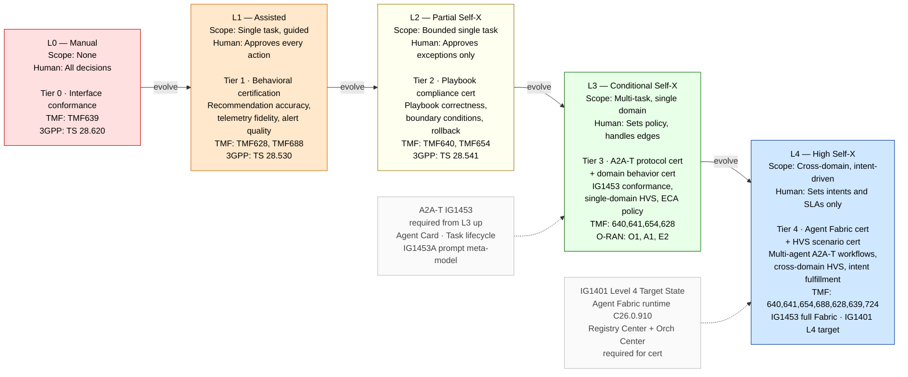

# TMForum Autonomous Networks — ACE-NET Certification Level Map

Maps TMForum autonomy levels L0–L4 (IG1218 / IG1401 Level 4 Industry Blueprint) to ACE-NET certification tiers, test suite types, and required TMF Open APIs. A2A-T protocol compliance (IG1453) is mandatory from L3 upward.

## Level Summary

| Level | Label | ACE-NET Tier | Chaos Faults in Scope |
|-------|-------|-------------|----------------------|
| L0 | Manual | Tier 0 — Interface conformance | None |
| L1 | Assisted | Tier 1 — Behavioral | None |
| L2 | Partial Self-X | Tier 2 — Playbook compliance | Network layer only |
| L3 | Conditional Self-X | Tier 3 — A2A-T protocol + domain | Network + single-domain fabric |
| L4 | High Self-X | Tier 4 — Fabric + HVS scenario | Network + full Agent Fabric layer |
