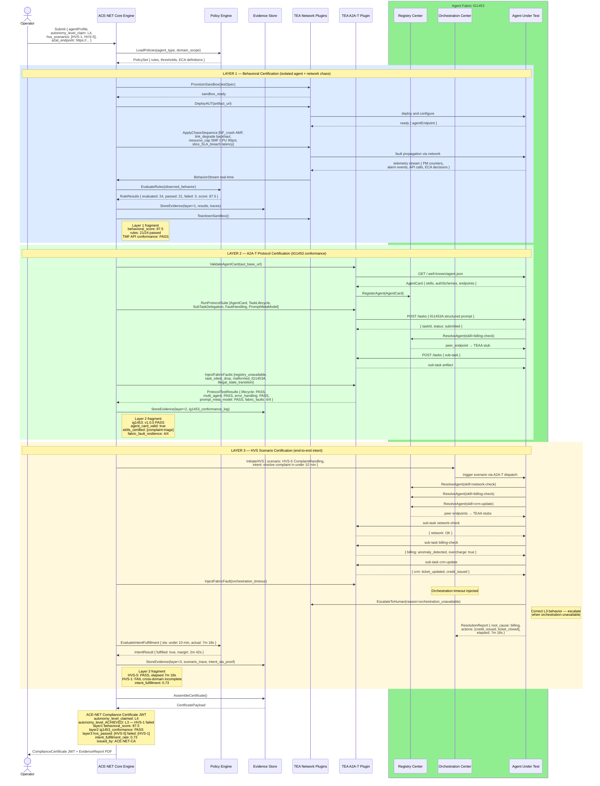

# ACE-NET Three-Layer Certification Evidence Chain

Full certification pipeline sequence across three layers: Layer 1 (behavioral — isolated agent under network chaos), Layer 2 (A2A-T protocol compliance per IG1453), and Layer 3 (end-to-end HVS scenario intent fulfillment). Culminates in a JWT Compliance Certificate that explicitly states the autonomy level achieved, which may differ from the level claimed.

## Certification Layer Summary

| Layer | Scope | Passes When | Key Evidence |
|-------|-------|-------------|-------------|
| **Layer 1 — Behavioral** | Isolated agent under network chaos | Behavioral score ≥ threshold, rules pass rate ≥ threshold | PM counters, alarm logs, API call traces |
| **Layer 2 — A2A-T Protocol** | IG1453 protocol conformance | All protocol assertions pass | Agent Card, task logs, fault handling traces |
| **Layer 3 — HVS Scenario** | End-to-end intent fulfillment | Scenario SLA met, intent fulfilled | Scenario trace, SLA proof, escalation log |

> **Note:** `autonomy_level_achieved` is computed by ACE-NET from Layer 3 results and may be lower than `autonomy_level_claimed`. An agent claiming L4 that fails cross-domain HVS-1 receives an L3 certificate.
