# ACE-NET Chaos Fault Taxonomy — Network Layer + Agent Fabric Layer

Two-layer fault taxonomy covering the full scope of chaos faults ACE-NET injects during certification. Network layer faults apply from Tier 2 upward; Agent Fabric faults (IG1453 / A2A-T) apply from Tier 3 upward.

```mermaid
flowchart LR
    classDef root   fill:#2E4057,stroke:#1a2d3f,color:#ffffff
    classDef branch fill:#4472C4,stroke:#2E5D9F,color:#ffffff
    classDef cat    fill:#BDD7EE,stroke:#5B9BD5,color:#000000
    classDef fault  fill:#E2EFDA,stroke:#70AD47,color:#000000

    ROOT(["ACE-NET Fault Taxonomy"]):::root

    NET["Network Layer Faults"]:::branch
    FAB["Agent Fabric Layer Faults<br/>A2A-T / IG1453"]:::branch

    ROOT --> NET
    ROOT --> FAB

    RAN["RAN Faults — O-RAN"]:::cat
    CORE["5G Core Faults — 3GPP"]:::cat
    TRANS["Transport Faults"]:::cat
    SLICE["Slice Faults"]:::cat

    NET --> RAN
    NET --> CORE
    NET --> TRANS
    NET --> SLICE

    RAN --> RF1["Cell outage<br/>O-DU or O-RU failure"]:::fault
    RAN --> RF2["Interference injection<br/>pilot pollution"]:::fault
    RAN --> RF3["Backhaul link degradation<br/>latency plus loss"]:::fault
    RAN --> RF4["Near-RT RIC E2<br/>interface disconnect"]:::fault
    RAN --> RF5["A1 policy delivery failure<br/>Non-RT to Near-RT"]:::fault

    CORE --> CF1["NF instance crash<br/>AMF, SMF, or UPF"]:::fault
    CORE --> CF2["SBA disruption<br/>NRF unavailable"]:::fault
    CORE --> CF3["PCF policy delivery failure"]:::fault
    CORE --> CF4["NSSF slice selection failure"]:::fault
    CORE --> CF5["Resource exhaustion<br/>CPU or memory cap"]:::fault

    TRANS --> TF1["Physical link failure<br/>NETCONF-injected"]:::fault
    TRANS --> TF2["Congestion burst<br/>sustained packet loss"]:::fault
    TRANS --> TF3["BGP route withdrawal<br/>reachability disruption"]:::fault

    SLICE --> SF1["SLA threshold breach<br/>bandwidth or latency"]:::fault
    SLICE --> SF2["Inter-slice resource conflict<br/>greedy slice"]:::fault
    SLICE --> SF3["Slice instantiation timeout"]:::fault

    REG["Registry Center Faults"]:::cat
    ORCH["Orchestration Center Faults"]:::cat
    PROT["A2A-T Protocol Faults"]:::cat
    PROM["IG1453A Prompt Meta-Model Faults"]:::cat

    FAB --> REG
    FAB --> ORCH
    FAB --> PROT
    FAB --> PROM

    REG --> RGF1["Registry complete unavailability"]:::fault
    REG --> RGF2["Stale or expired Agent Card<br/>skills changed"]:::fault
    REG --> RGF3["Conflicting skill declarations<br/>two agents claim same skill"]:::fault
    REG --> RGF4["Authentication token invalid<br/>or expired OAuth2 or mTLS"]:::fault
    REG --> RGF5["Agent Card schema violation<br/>missing required field"]:::fault

    ORCH --> OF1["Orchestration Center<br/>request timeout"]:::fault
    ORCH --> OF2["Circular task delegation loop<br/>A to B to A"]:::fault
    ORCH --> OF3["Workflow deadlock<br/>mutual dependency wait"]:::fault
    ORCH --> OF4["Orchestration capacity exhaustion"]:::fault
    ORCH --> OF5["IG1453A workflow schema rejection"]:::fault

    PROT --> PF1["Task non-delivery<br/>silent drop no error"]:::fault
    PROT --> PF2["Partial response<br/>truncated artifact"]:::fault
    PROT --> PF3["Duplicate task execution<br/>idempotency violation"]:::fault
    PROT --> PF4["Illegal state transition<br/>submitted direct to completed"]:::fault
    PROT --> PF5["Sub-task result injection<br/>TEA returns tampered artifact"]:::fault

    PROM --> PMF1["Malformed prompt<br/>missing intent or context"]:::fault
    PROM --> PMF2["Prompt injection<br/>adversarial instruction in task"]:::fault
    PROM --> PMF3["Oversized prompt<br/>exceeds context window"]:::fault
    PROM --> PMF4["Language or encoding mismatch<br/>non-declared locale"]:::fault
```

## Fault Layer to Certification Tier

| Fault Layer | Applies From | TEA Plugin | Typical Injector |
|-------------|-------------|-----------|-----------------|
| RAN (O-RAN) | Tier 2 | O-RAN O1/A1/E2 Plugin | Near-RT RIC E2 SM |
| 5G Core (3GPP) | Tier 2 | 3GPP NBI Plugin | NF lifecycle API |
| Transport | Tier 2 | NETCONF/YANG Plugin | Interface config |
| Slice | Tier 2 | TMF OpenAPI Plugin | TMF641 / TS 28.541 |
| Registry Center | Tier 3 | A2A-T Plugin | Registry mock / proxy |
| Orchestration Center | Tier 3 | A2A-T Plugin | Orchestration mock |
| A2A-T Protocol | Tier 3 | A2A-T Plugin | Task intercept proxy |
| IG1453A Prompt | Tier 3 | A2A-T Plugin | Prompt mutation |
