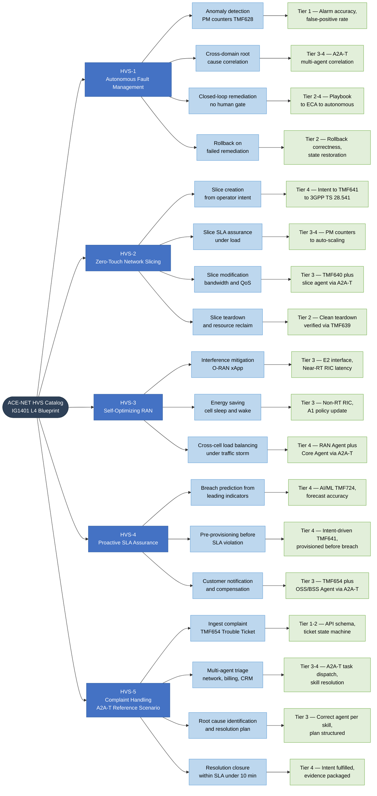

# TMForum High-Value Scenarios — ACE-NET Certification Decomposition

Decomposes the five priority High-Value Scenarios (HVS) from the IG1401 Level 4 Industry Blueprint into sub-scenarios, each mapped to an ACE-NET certification tier and relevant TMF/3GPP/O-RAN APIs. HVS-5 (Complaint Handling) is the reference walkthrough scenario for A2A-T multi-agent certification.

## HVS to Certification Tier Mapping

| HVS | Minimum Tier | Maximum Tier | Primary APIs |
|-----|-------------|-------------|-------------|
| HVS-1 Fault Management | Tier 1 | Tier 4 | TMF628, TMF654, IG1453 |
| HVS-2 Zero-Touch Slicing | Tier 2 | Tier 4 | TMF641, TMF640, TMF639, TS 28.541 |
| HVS-3 Self-Optimizing RAN | Tier 3 | Tier 4 | O-RAN O1/A1/E2, IG1453 |
| HVS-4 Proactive SLA Assurance | Tier 4 | Tier 4 | TMF724, TMF641, TMF654, IG1453 |
| HVS-5 Complaint Handling | Tier 1 | Tier 4 | TMF654, IG1453, all domain APIs |
