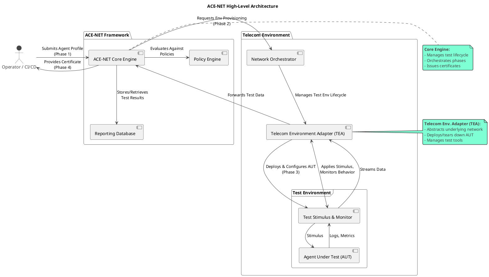

## 3. ACE-NET Architectural Framework

The ACE-NET architecture is designed for modularity and extensibility, allowing it to adapt to the diverse and evolving telecom landscape.

### 3.1. High-Level Architecture

ACE-NET sits as a central verification authority that interacts with various parts of the telecom ecosystem. It is not typically an inline component but rather an offline or near-line system used for certification and continuous monitoring. The following PlantUML code describes the high-level architecture.

*Figure 1: ACE-NET High-Level Architecture*

---

### 3.2. Key Components

- **ACE-NET Core Engine:** The heart of the system. It is responsible for parsing Agent Profiles and Compliance Policies, selecting the appropriate Test Suites, orchestrating the test execution flow, and making a final compliance determination.

- **Test Suite Repository:** A version-controlled repository that stores the Compliance Test Suites (CTS). These suites are modular and can be specific to a technology (e.g., "5G NSSF Behavior CTS"), a use case ("eMBB Slice SLA CTS"), or a policy ("Data Sovereignty CTS").

- **Policy & Profile Repository:** A database that stores the machine-readable Agent Profiles and Compliance Policies. This allows for dynamic test selection based on the specific agent being tested and the operator's current ruleset. Policies SHOULD be defined using the YANG model in Section 5.2.

- **Log & Report Generator:** This component securely aggregates all logs, metrics, and traces generated during a test run. It then compiles this data into a human-readable report and a machine-readable Compliance Certificate, structured according to the data model in Section 5.3.

- **Telecom Environment Adapter (TEA):** This is the primary adaptation that makes ACE suitable for networking. The TEA is a collection of plugins or modules that provide a standardized interface for the ACE-NET Core to interact with the heterogeneous telecom environment. Each module translates abstract commands (e.g., "Create a network slice with X properties") into the specific API calls or protocols required by the target system.

  > **Example TEA Modules:** 3GPP NBI (Network northbound interface), O-RAN interfaces, NETCONF/YANG, TMF OpenAPIs, Kubernetes API, public cloud APIs, etc.